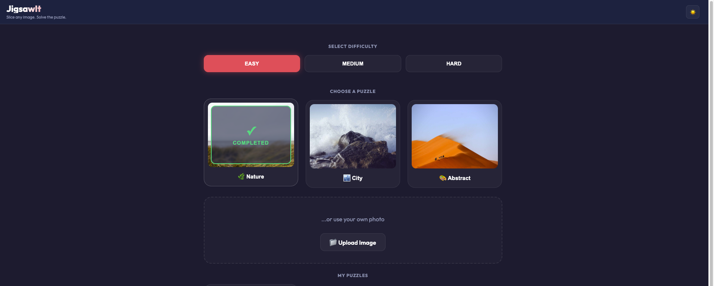
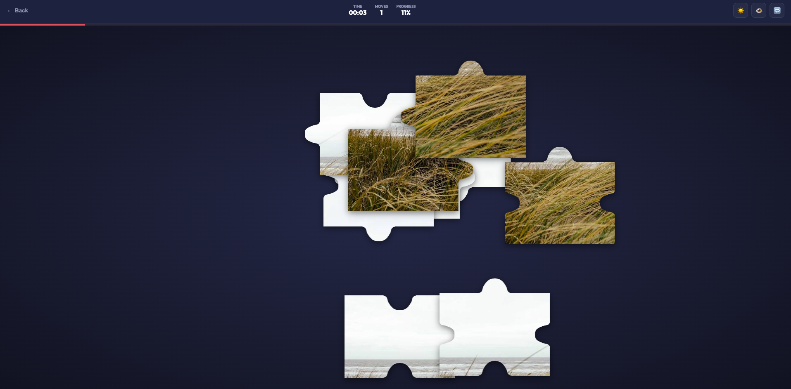

# JigsawIt 🧩

A browser-based jigsaw puzzle application. Upload any image, pick a difficulty, and solve the puzzle. Zero backend, pure frontend experience.

<table>
  <tr>
    <td></td>
    <td></td>
  </tr>
  <tr>
    <td align="center"><em>Menu & Image Upload</em></td>
    <td align="center"><em>Active Puzzle Gameplay</em></td>
  </tr>
</table>


## 🚀 Features

- **Any Image**: Upload your own photos or choose from curated presets.
- **Dynamic Slicing**: Images are sliced into realistic jigsaw pieces using HTML5 Canvas API and Bezier curves.
- **Smart Snap**: Pieces connect to their correct neighbors when dropped nearby, forming clusters that move together.
- **Difficulty Levels**:
  - 🟢 **Easy**: 3x3 grid (9 pieces)
  - 🟡 **Medium**: 4x4 grid (16 pieces)
  - 🔴 **Hard**: 6x6 grid (36 pieces)
- **Responsive Design**: Mobile-friendly with native drag-and-drop and touch support.
- **Progress Tracking**: Real-time stats for time elapsed, moves made, and completion percentage.

## 🛠️ Stack

- **React**: Functional components and hooks for state management.
- **Vite**: Ultra-fast development environment and bundling.
- **HTML5 Canvas API**: For high-performance image processing and piece generation.
- **CSS Modules**: Clean, scoped styling with CSS variables for theming.
- **Testing**: Vitest, React Testing Library, and JSdom for robust unit testing.

## 📦 Installation

1. Clone the repository:
   ```bash
   git clone https://github.com/your-username/imagejigsawapp.git
   ```
2. Install dependencies:
   ```bash
   npm install
   ```

## 🏃 Running the App

Start the development server:
```bash
npm run dev
```
Open [http://localhost:5173](http://localhost:5173) in your browser.

To build for production:
```bash
npm run build
```

## 🧪 Testing

The project maintains high quality with >90% test coverage.

Run all tests:
```bash
npm test
```

Run tests with coverage report:
```bash
npm run test:coverage
```

## 🎨 Theme

- **Background**: `#1a1a2e`
- **Board**: `#16213e`
- **Accent**: `#e94560`

## 📄 License

MIT
